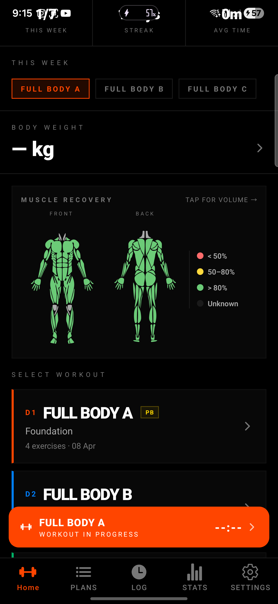
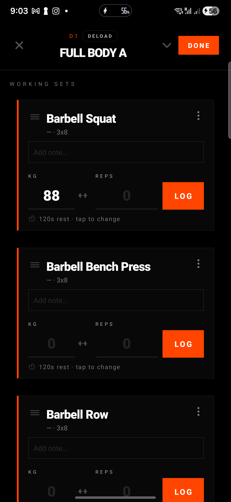
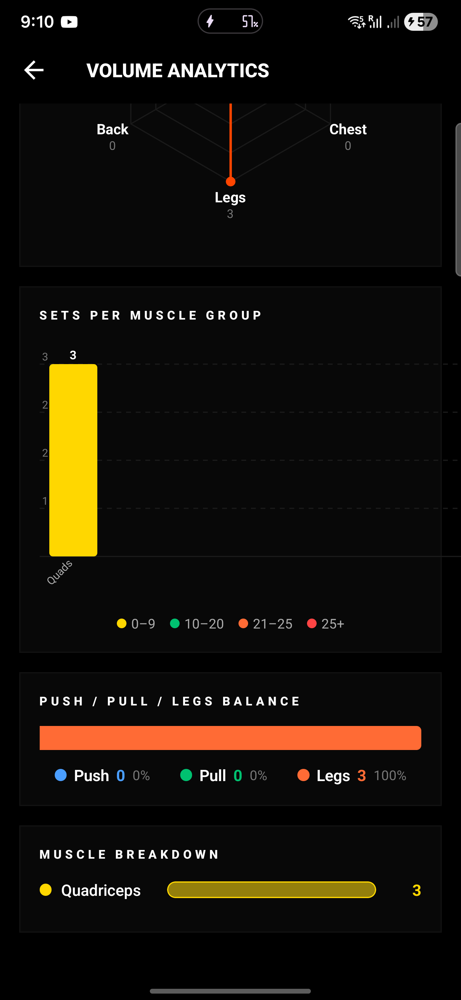
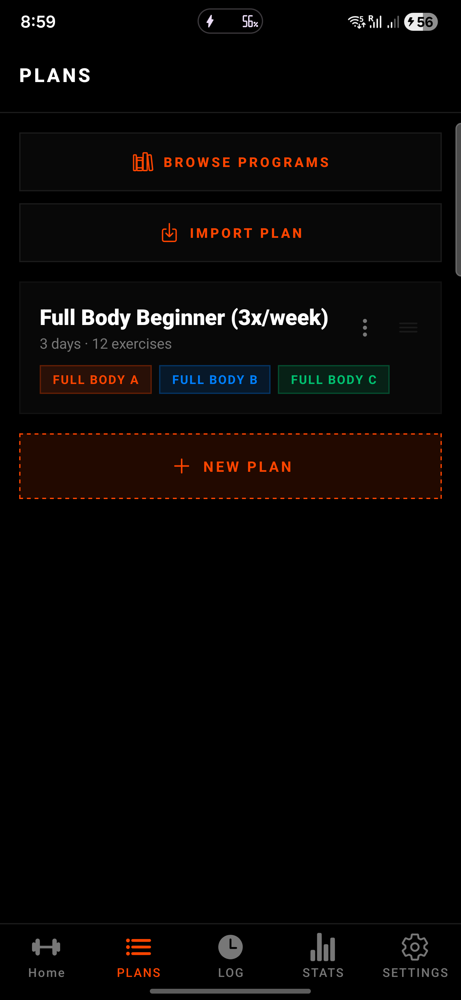

<div align="center">
  

  <h1>IronLog</h1>

  <p><strong>Offline-first workout tracker with recovery heatmaps and useful analytics.</strong></p>

  <p>Built for lifters who want faster logging, real muscle and recovery insight, and local-first control over their training data without cloud lock-in.</p>

  <p>
    <a href="https://github.com/DeccanHYD/Ironlog/releases"></a>
    <a href="https://github.com/DeccanHYD/Ironlog/releases"></a>
    <a href="https://github.com/DeccanHYD/Ironlog/commits"></a>
    <a href="LICENSE"></a>
  </p>

  <p>
    <a href="https://github.com/DeccanHYD/Ironlog/releases/latest"></a>
    <a href="https://github.com/DeccanHYD/Ironlog/releases/latest"></a>
  </p>

  <p><sub>Android 7.0+ • offline-first • backup and CSV export built in</sub></p>
</div>

## Screenshots

<table>
  <tr>
    <td align="center" width="50%">
      
      <br />
      <strong>Home overview</strong>
      <br />
      Recovery map, streaks, and a clear next-workout recommendation.
    </td>
    <td align="center" width="50%">
      
      <br />
      <strong>Workout logging</strong>
      <br />
      Fast set-by-set logging with notes, rest timers, and smart defaults.
    </td>
  </tr>
  <tr>
    <td align="center" width="50%">
      
      <br />
      <strong>Volume analytics</strong>
      <br />
      Radar, muscle breakdowns, and push/pull/legs balance from real training data.
    </td>
    <td align="center" width="50%">
      
      <br />
      <strong>Plans and templates</strong>
      <br />
      Reusable workout days, program structure, and quick setup for your next block.
    </td>
  </tr>
</table>

> Built for lifters who want speed, local control, and recovery visibility without subscription bloat.

## Download

Download the latest Android APK from [GitHub Releases](https://github.com/DeccanHYD/Ironlog/releases/latest).

_Requires Android 7.0 or higher._

## Why IronLog

IronLog is designed to feel fast in the gym and useful after the session. You can log quickly, see recovery and volume clearly, and keep your data on-device instead of depending on a cloud-first backend.

## What You Get

- Fast workout logging with set-by-set entry, smart defaults, rest timers, resume support, and in-workout actions.
- Recovery heatmaps with interactive front/back muscle views instead of generic recovery scores.
- Volume analytics with weekly totals, muscle breakdowns, push/pull/legs balance, radar charts, and share cards.
- Programs and planning tools with editable workout days, templates, onboarding setup, and plan recommendations.
- Exercise tools with search, custom exercises, swaps, and YouTube demo links right from workout flows.
- Progress tracking for body weight, measurements, PRs, history, and calendar views.
- Local-first data tools with backups, restore flows, CSV import/export, privacy controls, and image caching.
- Gym quality-of-life features including gym profiles, bar weight setup, plate calculator, haptics, and theme support.

## Build From Source

```bash
npm install
npx expo run:android
```

If you need to generate native folders locally first:

```bash
npx expo prebuild
```

## Contributing

See [CONTRIBUTING.md](CONTRIBUTING.md) and [CODE_OF_CONDUCT.md](CODE_OF_CONDUCT.md).

## License

IronLog is source-available, not open source in the standard OSI sense.

It is released under the [IronLog Personal Use License](LICENSE) for personal and non-commercial use. Commercial use requires permission.
